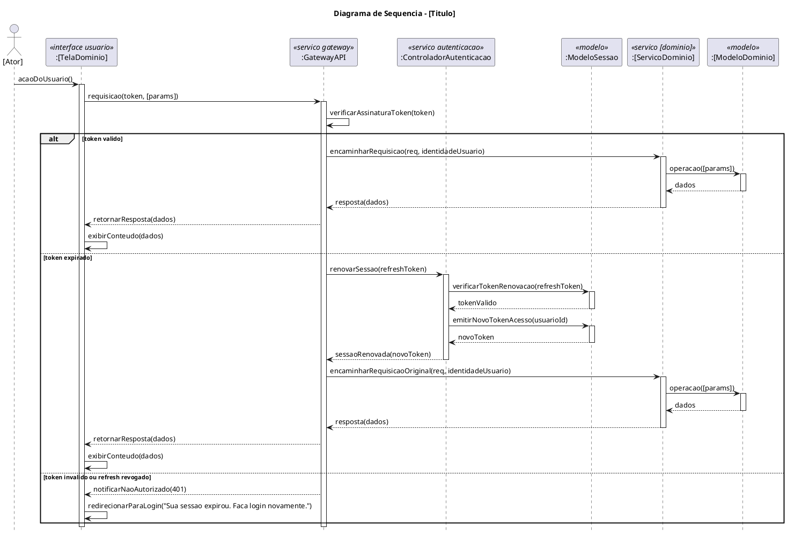

# Gerar Diagrama de Sequência UML (PlantUML)

Gera diagramas de sequência UML em PlantUML seguindo a arquitetura real do Movecity — microserviços com API Gateway (US #31) entre frontend e qualquer serviço de backend.

## Critérios obrigatórios (aplicar em TODOS os diagramas da sessão)

1. **API Gateway obrigatório** — toda requisição do frontend passa por `:GatewayAPI <<servico gateway>>` antes de qualquer serviço de backend. Nunca ignorar o Gateway.

2. **Estereótipos por tipo de participante:**
   - Frontend: `<<interface usuario>>`
   - Gateway: `<<servico gateway>>`
   - Serviços de domínio: `<<servico [dominio]>>`
   - Auth: `<<servico autenticacao>>`
   - Modelos: `<<modelo>>`
   - Notificação: `<<servico notificacao>>`

3. **Ator** inicia a partir da View (fora das lifelines de serviço).

4. **Nível de análise** — sem implementação, framework ou tecnologia.

5. **`activate` / `deactivate`** balanceados em toda lifeline ativa.

6. **`hide footbox`** — sempre presente.

7. **Validação de sessão via Gateway (US #31)** — obrigatória em recursos protegidos. O Gateway valida JWT localmente e o bloco `alt` tem 3 ramificações:
   - Token válido → encaminha ao serviço com `identidadeUsuario`
   - Token expirado → renova via `:ControladorAutenticacao` + `:ModeloSessao` → reencaminha (transparente)
   - Token inválido/refresh revogado → `401` → View redireciona para login com `"Sua sessao expirou. Faca login novamente."`

8. **Serviços de domínio NÃO validam sessão** — responsabilidade exclusiva do Gateway.

9. **Loops de tempo real** usam o caminho feliz via Gateway (sem repetir o bloco `alt` completo).

## Estrutura base PlantUML

## Fluxo de execução

**Se o caso de uso não foi fornecido**, solicitar: nome, ator, pré-condição, fluxo principal, fluxos alternativos.

**Com o caso de uso em mãos**, substituir os placeholders `[...]` pelo domínio específico e adicionar a lógica de negócio dentro dos blocos `alt token valido` e `else token expirado`.

## Saída esperada

1. Bloco PlantUML completo e pronto para renderização
2. Descrição textual resumida do fluxo (2–4 linhas, PT-BR)
3. Pergunta sobre fluxos alternativos, se relevante

---

**Uso:** `/gerar-diagrama-sequencia [caso de uso opcional]`

**Referências:** `docs/diagramas/sequencia/` — padrão já aplicado em UC14–UC21. Issues #11 e #31 — fonte de verdade da arquitetura.
