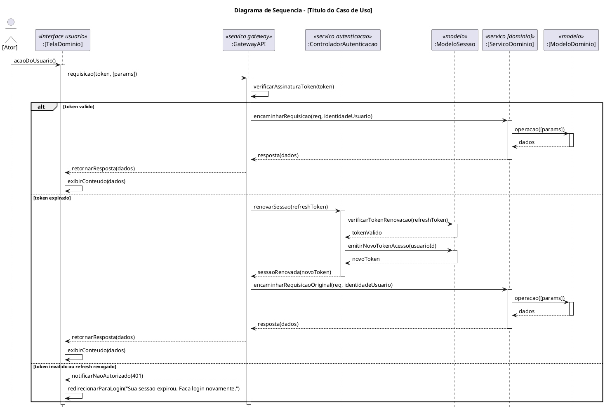

# Skill: Gerar Diagrama de Sequência UML (PlantUML)

## <instructions>

### Passo 1 — Coletar o caso de uso

Se o usuário ainda não forneceu um caso de uso completo, solicite:

- **Nome do caso de uso**
- **Ator principal** (ex: Passageiro, Motorista)
- **Pré-condição** (estado do sistema antes da interação)
- **Fluxo principal** (lista numerada de passos)
- **Fluxos alternativos ou de exceção** (opcional)

### Passo 2 — Aplicar os critérios arquiteturais obrigatórios

Gere o **código completo em PlantUML** seguindo rigorosamente:

1. **Arquitetura de microserviços com API Gateway** — toda requisição do frontend passa pelo `:GatewayAPI` antes de chegar a qualquer serviço de backend. O Gateway nunca é ignorado.

2. **Estereótipos obrigatórios por tipo de participante:**
   - Frontend: `<<interface usuario>>`
   - Gateway: `<<servico gateway>>`
   - Serviços de domínio: `<<servico [dominio]>>` (ex: `<<servico localizacao>>`, `<<servico rotas>>`)
   - Serviço de autenticação: `<<servico autenticacao>>`
   - Modelos/dados: `<<modelo>>`
   - Notificação: `<<servico notificacao>>`

3. **Ator** inicia a sequência a partir da View (fora das lifelines de serviço).

4. **Nível de análise** — sem detalhes de implementação, framework ou tecnologia.

5. **`activate` / `deactivate`** em toda lifeline que recebe foco de execução. Ativações balanceadas — todo `activate` tem seu `deactivate` correspondente.

6. **`hide footbox`** — sempre presente.

7. **Validação de sessão pelo Gateway (US #31)** — obrigatória em todo caso de uso com recurso protegido. O Gateway valida o JWT **localmente** (sem round-trip ao Auth Service) e o fluxo `alt` tem três ramificações:
   - **Token válido** → Gateway encaminha ao serviço de domínio com `identidadeUsuario` no header interno
   - **Token expirado** → Gateway chama `:ControladorAutenticacao` → renova via `:ModeloSessao` → reencaminha requisição original (transparente para o usuário)
   - **Token inválido ou refresh revogado** → Gateway retorna `401` à View → View redireciona para login com a mensagem `"Sua sessao expirou. Faca login novamente."`

8. **Controllers de domínio NÃO validam sessão** — isso é responsabilidade exclusiva do Gateway. Os serviços de domínio recebem apenas a requisição já autenticada com a identidade do usuário.

9. **Loops de atualização em tempo real** (quando aplicável) usam o caminho feliz via Gateway, sem repetir o bloco completo de validação de sessão.

### Passo 3 — Estrutura base do bloco PlantUML

### Passo 4 — Saída esperada

1. Bloco PlantUML completo e pronto para renderização
2. Descrição textual resumida do fluxo (2–4 linhas, PT-BR)
3. Pergunta sobre fluxos alternativos, se relevante

### Passo 5 — Persistência do padrão

Manter esses critérios para **todos os diagramas de sequência** da sessão até instrução contrária do usuário.

</instructions>

## <available_resources>
- `docs/diagramas/sequencia/`: diagramas já gerados para referência de padrão e nomenclatura
- `docs/documento_visao.md`: contexto do domínio Movecity para nomear participantes corretamente
- Issues #11 e #31 no GitHub: fonte de verdade da arquitetura com GatewayAPI
</available_resources>

## Exemplos de Acionamento

- "Gere o diagrama de sequência para Registrar Ocorrência."
- "Crie um diagrama UML para o fluxo de login do passageiro."
- "Diagrama de sequência: o motorista consulta o histórico de viagens."
