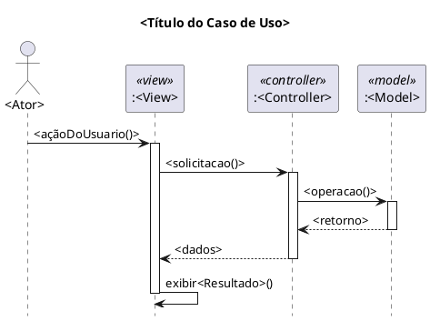

# Skill: Gerar Diagrama de Sequência UML (PlantUML)

## <instructions>

### Passo 1 — Coletar o caso de uso

Se o usuário ainda não forneceu um caso de uso completo, solicite as seguintes informações:

- **Nome do caso de uso**
- **Ator principal** (ex: Professor, Aluno, Passageiro)
- **Pré-condição** (estado do sistema antes da interação)
- **Fluxo principal** (lista numerada de passos)
- **Fluxos alternativos ou de exceção** (opcional)

### Passo 2 — Aplicar os critérios padrão obrigatórios

Gere o **código completo em PlantUML** seguindo rigorosamente:

1. **Arquitetura MVC** — toda interação passa por View → Controller → Model
2. **Participantes como objetos UML** no formato `:Classe`, com estereótipos:
   - `:NomeView <<view>>`
   - `:NomeController <<controller>>`
   - `:NomeModel <<model>>`
3. **Ator** inicia a sequência (fora das lifelines MVC)
4. **Nível de análise** — sem detalhes de implementação, framework ou tecnologia
5. **`activate` / `deactivate`** em toda lifeline que recebe foco de execução
6. **Responsabilidades por camada:**
   - View → envia ação do usuário ao Controller; executa `exibir...()` e `solicitar...()` internamente; se atualiza via `notificarAtualizacao()` observando o Model
   - Controller → valida, coordena, chama o Model; devolve dados à View; **nunca comanda a View diretamente**
   - Model → persiste e recupera dados; notifica observers quando muda de estado
7. **`hide footbox`** — sempre presente para ocultar o rodapé das lifelines
8. **Ativações balanceadas** — todo `activate` deve ter seu `deactivate` correspondente

### Passo 3 — Estrutura do bloco PlantUML

### Passo 4 — Saída esperada

- Exibir o **bloco PlantUML completo** pronto para renderização
- Após o código, apresentar uma **descrição textual resumida** do fluxo representado (2–4 linhas, PT-BR)
- Se houver fluxos alternativos relevantes, perguntar se o usuário quer um diagrama adicional para eles

### Passo 5 — Persistência do padrão

Manter esses critérios para **todos os diagramas de sequência** solicitados na sessão, até que o usuário diga explicitamente o contrário.

</instructions>

## <available_resources>
- Especificação PlantUML: sintaxe de sequence diagrams
- `docs/documento_visao.md`: contexto do domínio Movecity para nomear participantes corretamente
</available_resources>

## Exemplos de Acionamento

- "Gere o diagrama de sequência para o caso de uso Registrar Frequência."
- "Crie um diagrama UML MVC para o fluxo de login do passageiro."
- "Diagrama de sequência: o motorista reporta uma ocorrência no app."
